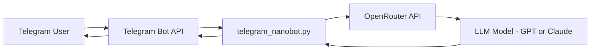

## 🏗 Architecture

### 🔄 System Flow

---

### 🧠 How It Works

1. User sends a message in Telegram  
2. Telegram Bot API forwards the request  
3. `telegram_nanobot.py` processes the input  
4. Request is sent to OpenRouter  
5. OpenRouter routes to the configured LLM  
6. Model generates a response  
7. Response is returned to the user

🧩 Architecture Layers
📱 Chat Layer

Telegram User Interface

Telegram Bot API

🧠 Bot Layer

telegram_nanobot.py

Handles message parsing

Sends prompts to OpenRouter

Returns formatted responses

🌐 AI Layer

OpenRouter API

Configured LLM model (GPT / Claude / etc.)

🔁 Response Layer

AI response sent back to Telegram user

🚀 Design Principles

⚡ Ultra-lightweight architecture

🧩 Modular and extendable

🔐 Secure environment variable configuration

🔄 Model flexibility via OpenRouter

🛠 Easy to extend with memory or tools

🔮 Future Extensions

Persistent conversation memory

Tool integrations (search, APIs, automation)

Multi-model routing

Deployment containerization (Docker)

Logging & monitoring layer
